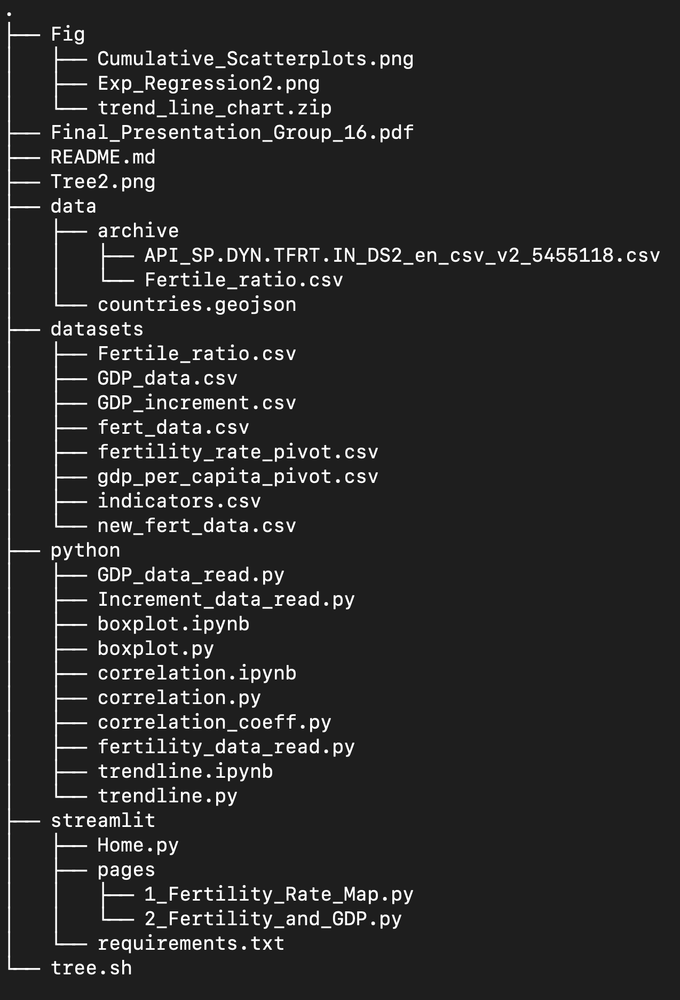

# Python-Data-Analysis-Fertility-Rates

___

**Navigation:**

In the home page, along with the tree navigation above, the pdf file has a breakdown of the findings from the data analysis that we conducted over various years and various countries, using the datasets mentioned in the presentation. 
